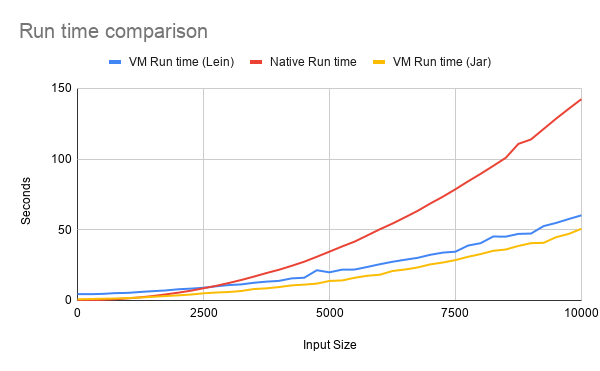

# fluky

A random string generator based on a regex.

> Fluky: Something obtained or achieved more by chance than skill.

## Usage

This is a Leiningen/Clojure project, a prerequisite to compile this requires
leiningen. For the installation of Leiningen, see https://leiningen.org/

The first option is to run using shell command line arguments:
```
lein run '[-+]?[0-9]{1,16}[.][0-9]{1,6}'
"2357698.3"

lein run '[a-z]{20}'
"jkidghravucpblysumto"

lein run 10 '[a-z]{20}'  # generate 10 samples
"fdnmfiegvrlumxsflxcs"
"xgchzldmulteiqpagorz"
"qhqixqhkvbkmbobkquvc"
"khkqbslyuugwzphzabgy"
"manqecvywjsnvxpiyign"
"qgnjmojraykfufmvritb"
"duvxcixxtpggqjuyelor"
"zepiujyaoklrefpmipso"
"zhtiumwjoakporwhpuan"
"aaggbjsypuaztoqptbop"
```

The second option is to use the repl:
```
lein repl

fluky.core=> (random-regex "[a-z]{5}")
"ztrad"

fluky.core=> (random-regex "[-+]?[0-9]{1,16}[.][0-9]{1,6}")
"-824.7015"
```

## What is Supported

- `.` Match any character except newline
- `[` Start character class definition
- `]` End character class definition
- `?` 0 or 1 quantifier
- `*` 0 or more quantifiers
- `+` 1 or more quantifier
- `{` Start min/max quantifier
- `}` End min/max quantifier

Within a character class, the following meta characters are supported:

- `^` Negate the class, but only if the first character
- `-` Indicates character range


## Implementation Note
1. Some ambiguous regexes, those with nested brackets, may not match with Java's pattern compilation but it matches the regex parser in https://regexr.com/
2. Only characters between these ranges are accepted in the regex: a-z, A-Z, 0-9
3. This uses a manual parser of string (`string` ===lexer===> `tokens` ===parser===> `tree` + `random characters`)
4. Sample parse tree for `[-+]?[0-9]{1,16}[.][0-9]{1,6}`:

```clojure
[[:QMARK_QUANTIFIER [:SET [:CHAR \-] [:CHAR \+]]]
 [:MIN_MAX_QUANTIFIER [1 16] [:SET [:RANGE [:CHAR \0] [:CHAR \9]]]]
 [:SET [:CHAR \.]]
 [:MIN_MAX_QUANTIFIER [1 6] [:SET [:RANGE [:CHAR \0] [:CHAR \9]]]]]
```

## Performance Analysis

This random generator uses ranges of ASCII values to generate individual characters based
on the regex. Here is a quick benchmark on the performance with fairly large sized regexes
(usually >10 chars). We are using [criterium](https://github.com/hugoduncan/criterium) here:


```clojure

;;;; *** Setup ***

(require 'fluky.core-test)
(in-ns 'fluky.core-test)
(require '[clojure.test.check.generators :as gen])
(require '[criterium.core :as criterium]) ;;https://github.com/hugoduncan/criterium
(def samples
   (with-open [rdr (clojure.java.io/reader "resources/samples.txt")]
     (doall (line-seq rdr))))
(def n (count samples))
(def counter (agent 0))
(defn next-regex
  []
  (nth samples @(send counter (fn [i] (mod (inc i) n)))))


;;;; *** Benchmark ***

(criterium/with-progress-reporting
  (criterium/bench
   (let [regex-str (next-regex)]
     (sut/random-regex regex-str))
   :verbose))

```

The result of the above:

```
x86_64 Mac OS X 10.15.7 4 cpu(s)
Java HotSpot(TM) 64-Bit Server VM 25.121-b13
Evaluation count : 257940 in 60 samples of 4299 calls.
      Execution time sample mean : 270.872465 µs
             Execution time mean : 271.164718 µs
Execution time sample std-deviation : 299.459117 µs
    Execution time std-deviation : 299.495176 µs
   Execution time lower quantile : 208.194823 µs ( 2.5%)
   Execution time upper quantile : 251.850580 µs (97.5%)
                   Overhead used : 2.061289 ns

Found 10 outliers in 60 samples (16.6667 %)
    low-severe	 2 (3.3333 %)
    low-mild	 3 (5.0000 %)
    high-mild	 3 (5.0000 %)
    high-severe	 2 (3.3333 %)
 Variance from outliers : 98.3127 % Variance is severely inflated by outliers
```

## Native Compilation

This simple library is compatible with GraalVM native image. Here are the steps for that.

1. Ensure Java version supports native images:

```shell
# Ensure Java 14+
java -version
openjdk version "14.0.1" 2020-04-14
OpenJDK Runtime Environment (build 14.0.1+7)
OpenJDK 64-Bit Server VM (build 14.0.1+7, mixed mode, sharing)
```

2. Generate the uber jar:

```shell
lein do clean, compile, uberjar
```

3. Compile the native image from the uberjar into a file called `./target/fluky`:

```shell
/path/to/graalvm-ce-java8-20.0.0/Contents/Home/bin/native-image \
             --initialize-at-build-time \
             --no-server \
             -jar ./target/uberjar/fluky-0.1.0-SNAPSHOT-standalone.jar \
             -H:Name=./target/fluky
```

4. Run the native image and compare to performance on the VM:

```shell

# Lein VM
time lein run 1000 '[^a-z]{100}' > /dev/null

real	4.15s
user	10.40s
sys	0.55s


# Jar VM
time lein run 1000 '[^a-z]{100}' > /dev/null

real	5.03s
user	9.83s
sys	0.60s


# Native
time ./target/fluky 1000 '[^a-z]{100}' > /dev/null

real	0.26s
user	0.21s
sys	0.04s
```

While the native image does seem faster above, it will only be so while the startup of the JVM
is the bottleneck. After a while and number of computations, JVM's optimizations will overtake
the static native image. Here is a graph plotting on the X-axis the input size X and the time
taken to run with `lein run X '[^a-z]{X}'` or `./target/fluky X '[^a-z]{X}'` or `java -jar fluky.jar X '[^a-z]{X}'`:



This was generated using

```shell
for i in `seq 0 250 10000`; do gtime -f "%e" ./target/fluky $i "[^a-z]{$i}" > /dev/null; done ;
for i in `seq 0 250 10000`; do gtime -f "%e" lein run $i "[^a-z]{$i}" > /dev/null; done ;
for i in `seq 0 250 10000`; do gtime -f "%e" java -jar ./target/uberjar/fluky-0.1.0-SNAPSHOT-standalone.jar $i "[^a-z]{$i}" > /dev/null; done ;
```

## License

Copyright © 2020 Mourjo Sen

This program and the accompanying materials are made available under the
terms of the Eclipse Public License 2.0 which is available at
http://www.eclipse.org/legal/epl-2.0.

This Source Code may also be made available under the following Secondary
Licenses when the conditions for such availability set forth in the Eclipse
Public License, v. 2.0 are satisfied: GNU General Public License as published by
the Free Software Foundation, either version 2 of the License, or (at your
option) any later version, with the GNU Classpath Exception which is available
at https://www.gnu.org/software/classpath/license.html.
